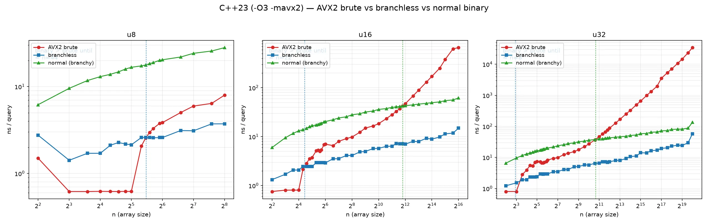
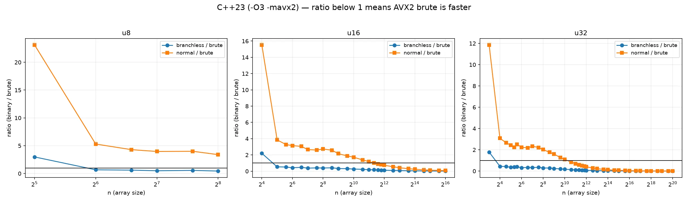
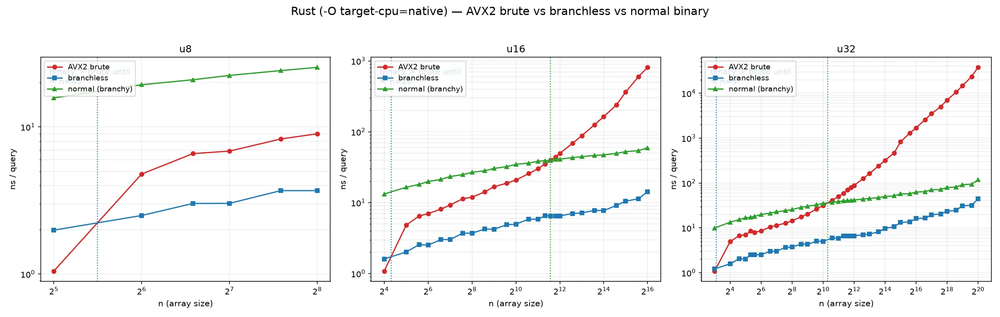
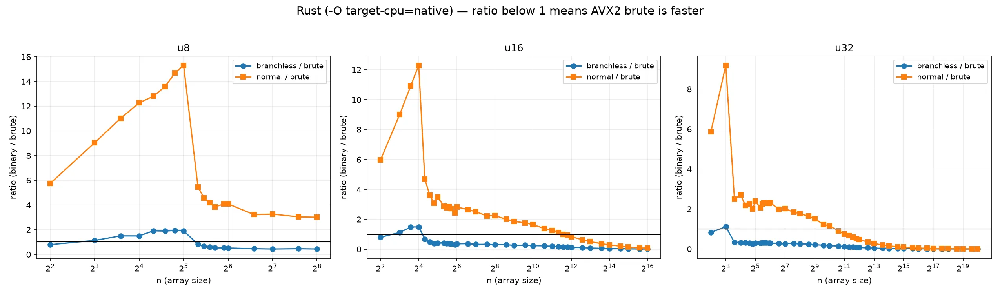
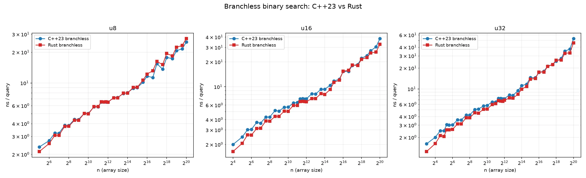
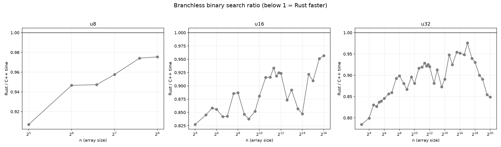

# AVX2 暴力查找 vs 无分支二分 vs 普通二分（u8/u16/u32）

同一个 `lower_bound`（排序数组、值唯一、查询随机命中），在同一台机器上对比：

- **AVX2 brute**：每次载入 32 字节做无符号 `>=` 比较 + `movemask`，数组尾部补一个 vector，避免标量尾巴。
- **branchless**：C++ 手写 monobound，汇编确认是 `cmov`；Rust 用 `partition_point`（LLVM 生成无分支版本）。
- **normal**：普通 `if (a[mid] < x)` 二分，汇编确认是条件跳转。

编译：C++23 用 `-O3 -mavx2`，Rust 用 `-O -C target-cpu=native`。
测量：固定单个 P-core（`taskset -c 0`），三种方法交错测量；每个方法先校准到约 3 ms
一轮的查询数，再跑 9 轮取中位数。Rust 查询用 splitmix64 的高 32 位生成，避免
LCG 在 2 的幂 n 上出现周期性坏数据。C++ 和 Rust 必须串行跑，不能并行抢核。
n 只取 vector 宽度整数倍（u8=32、u16=16、u32=8），避免半向量尾巴影响比较。
三种类型统一扫到 n=1048576；u8/u16 超过唯一值域后使用非降序重复值
`a[i] = i * domain / n`（domain 分别为 256 / 65536），保证与 u32 相同的 N 范围。

## 复现

```bash
nix develop            # gcc/rustc/python+matplotlib
make bench-run         # ./bench > results.csv  (C++23)
make bench-run-rs      # ./bench_rs > results_rs.csv  (Rust)
make plot              # 生成 4 张图 + 输出临界点
```

## 本机结果（i9-13950HX，排序唯一值，随机命中查询）

“临界点 n”指：n 小于该值时 AVX2 brute 更快，n 大于该值时二分更快。

| 类型 | vs branchless（C++23） | vs normal（C++23） | vs branchless（Rust） | vs normal（Rust） |
| --- | ---: | ---: | ---: | ---: |
| u8 | ≈ 53 | ≈ 3750 | ≈ 45 | ≈ 3910 |
| u16 | ≈ 24 | ≈ 2640 | ≈ 20 | ≈ 3220 |
| u32 | ≈ 11 | ≈ 1200 | ≈ 9 | ≈ 1270 |

直观结论：

- u8 对无分支二分大约在 32~64 之间反超；对普通二分能压到约 n≈3750。
- u16/u32 的“对 branchless 临界点”大约就是 1~1.5 个 AVX2 vector 能覆盖的长度（16/8 个元素量级）。
- 普通二分因为分支预测失败，在缓存内小数组上非常吃亏；AVX2 brute 能压到几千个元素（u16/u32）甚至整个 u8 值域。

图（WebP）：









原始数据：`results.csv`（C++23）、`results_rs.csv`（Rust）。

## C++23 vs Rust：无分支二分





两者整体在同一水平；大 n 时 Rust 略快一点（Rust 的 `partition_point` 生成的
无分支循环在部分规模上更紧凑）：

| 类型 / n | C++23 (ns) | Rust (ns) | Rust/C++ |
| --- | ---: | ---: | ---: |
| u8 / 256 | 3.82 | 3.77 | 0.99 |
| u16 / 65536 | 15.29 | 15.46 | 1.01 |
| u32 / 1048576 | 53.13 | 46.14 | 0.87 |
